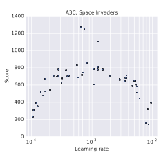

# Advantage Actor-Critic

## Background

Given the issues I ran into with single step neural network based Q-learning and Actor-Critic, I want to try out [Asynchronous Advantage Actor-Critic (A3C)](https://arxiv.org/pdf/1602.01783.pdf).

The basic changes to the Actor-Critic Algorithm (and their benefits) are:

1. The use of Advantage as the training target:

    $$A = \sum_{i=0}^{k-1} \gamma^ir_{t+i} + \gamma^kV(s_{t+k}) - V(s_t) \text{ for }(k \leq t_{max})$$

2. The use of multiple independent copies of the agent-environment interaction with (optionally) differing exploration policies
    - Utilize multiple CPUs
    - Provides a more accurate sampling of the state-space in each batch
3. The use of batch updates / gradient accumulation from the multiple agents
    - Improves training stability
    - RMSProp accumulations are also shared across threads, to increase stability.
4. The use of N-step returns (forward-view) when updating the parameters
    - Actor selects $ N = t_{max}$ steps before updating (unless terminated)
    - Gradients accumulated from steps of size 1 to N
5. Adding the entropy of the policy to the loss function to discourage premature suboptimal convergence

### Implementation Details

#### Architecture (Mnih 2013)

1. Convolutional layer 16 filters of size 8 × 8 with stride 4; rectifier nonlinearity (likely ReLU)
2. Convolutional layer with with 32 filters of size 4 × 4 with stride 2; rectifier nonlinearity
3. Fully connected layer with 256 hidden units; rectifier nonlinearity
4. Two output layers from shared base:
    1. A softmax output with one entry per action representing the probability of selecting the action
    2. A single linear output representing the value function.

#### Training & Evaluation

Mostly Followed Van Hasselt / Mnih 2015.

- Tuned learning rate and gradient clipping on 6 games.
- Paper suggests a learning rate of $10^{-3}$
- Might need to tune for gradient clipping.

| Parameter                | Value |
|------------------------- | ----- |
| $\gamma$                 | 0.99  |
| $\alpha$ (RMSProp decay) | 0.99  |
| Entropy regularization β | 0.01  |
| $t_{max}$                | 5     |
| Action repeat            | 4     |

Evaluation: "The trained agents were evaluated by playing each game 30 times for up to 5 min each time with different initial random conditions"

#### Preprocessing (Mnih 2015)

- Frames are 210 x 160 128 colors
- Take max value over current frame and prev frame for each color to deal with flickers.
- Extract the luminance from RGB frame and downsample to 84 x 84
- 4 most recent frames stacked together
- You can find the [Code here](https://sites.google.com/a/deepmind.com/dqn)

#### Miscellaneous

- It seems like the frame update frequency of 4 is also tied to an action repeat of 4 as well. (Mnih 2015)
- Gradient clipping: the smooth L1 loss you were using before. When the |error| > 1, rather than using the squared error as the loss, you use the |error| which has a constant value for the gradient. (Mnih 2015)
    - You can tune the value rather than using 1.
    - This helps with games which have different score ranges

## Goals and Milestones

### Goals

1. Reproduce the Space Invader learning rate plot in Figure 2 with RMSProp, and then re-do it with Adam.

2. Reproduce the training curve for Space Invaders in the lower right corner of Figure 3 for X threads with X > 1. For both RMSProp and Adam.

3. Reproduce the score achieved in Table S3 for The A3C LSTM on Breakout and Space Invaders.

| Game           | A3C FF  | A3C LSTM |
| ---------------| --------| ---------|
| Breakout       | 681.9   | 766.8    |
| Space Invaders | 15730.5 | 23846.0  |

### Milestones

1. Code the A3C Algorithm and verify that it works on Cart-Pole
    - A FFW with 128 hidden nodes should work.
2. Code the ConvNet architecture in the paper and write code to achieve Goal #1
3. Write code to achieve Goal #2
4. Code the LSTM and write code to achieve Goal #3

