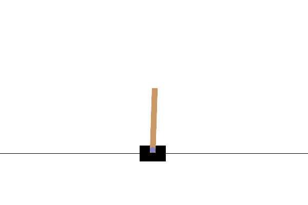

# Overview

The goal is to reproduce results from the original [Asynchronous Advantage Actor-Critic (A3C) Paper](https://arxiv.org/pdf/1602.01783.pdf)

A summary of the paper and high-level implementation plan can be found [here](./Motivation_and_Plan.md).

# Results

## Milestone 1: Use A3C to solve Cart-Pole

Before jumping into the complexity of Atari games and RL with Convolutional Neural Nets, I wanted to verify that my implementation and thread communication were working properly.

Cart-Pole is a fairly straightforward task, which has a [reference implementation in PyTorch](https://github.com/pytorch/examples/blob/main/reinforcement_learning/actor_critic.py) from which I could borrow some architecture and training parameters.

I was able to replicate the reference results, as well as see a speedup with multiple agents. I was then able to utilize agents running on multiple threads to solve CartPole as shown below:

The code which achieves all of these results [were written as unit tests](../../tests/test_a3c.py)
