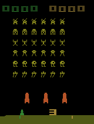
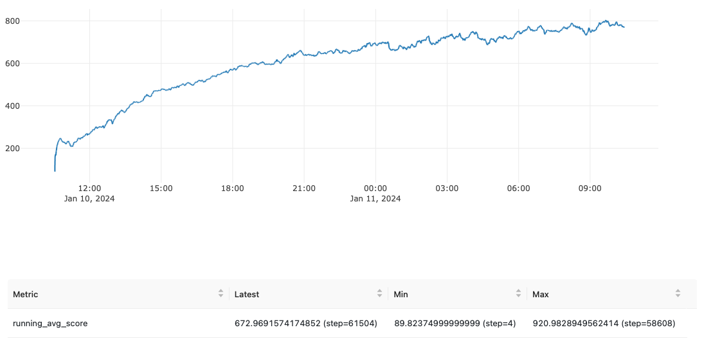
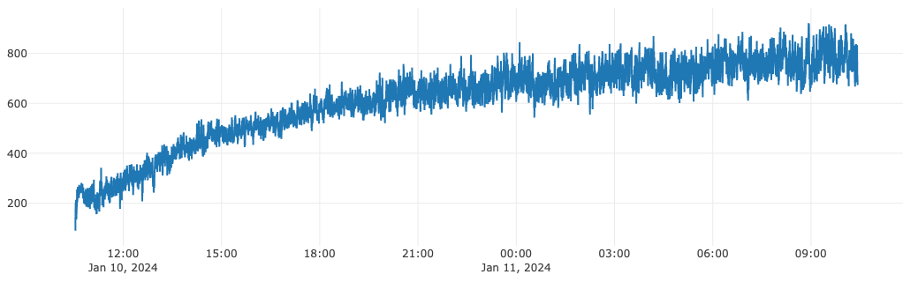

# Overview

The goal is to reproduce results from the original [Asynchronous Advantage Actor-Critic (A3C) Paper](https://arxiv.org/pdf/1602.01783.pdf)

A summary of the paper and high-level implementation plan can be found [here](./Motivation_and_Plan.md).

# Results

## Milestone 1: Use A3C to solve Cart-Pole

Before jumping into the complexity of Atari games and RL with Convolutional Neural Nets, I wanted to verify that my implementation and thread communication were working properly.

Cart-Pole is a fairly straightforward task, which has a [reference implementation in PyTorch](https://github.com/pytorch/examples/blob/main/reinforcement_learning/actor_critic.py) from which I could borrow some architecture and training parameters.

I was able to replicate the reference results, as well as see a speedup with multiple agents. I was then able to utilize agents running on multiple threads to solve CartPole as shown below:

The code which achieves all of these results [were written as unit tests](../../tests/test_a3c.py)

## Milestone 2: Match A3C Tuning Performance on SpaceInvaders

It turns out the M2 processor on my MacBookAir did not have the compute power to replicate the full picture of Figure 2 (each point would take roughly 24 hours to replicate). So I declared victory after matching a score of 800 (the mode of the results) after 50 epochs.

I had to make some modifications relative to the paper to get this to work:

- I used the Adam optimizer
- I implemented a thread lock on the global agent when backpropagating and updating parameters
- I turned the learning rate down to 1e-4
- I did not end episodes on loss of life. This was suggested in follow up work, and I think it simplified my code and made it easier to train.
- I did not utilize an annealing learning rate scheduler.
- Gradient norm clipping was set to 50 (as seen in a few open source implementations)
- I used 6 threads instead of 4, 8, of 16 since the M2 has 8 cores and I needed to run other programs.

Here is a GIF of the agent playing the game at epoch 48.

## Milestone 3: Reproduction of Training Curve

Curiously, the result in the plot below represents the average of the top three learning rates. Given that there are 3 positive outlier points in the figure above, and my compute limited compute budget, I did not feel compelled to replicate this slightly cherry-picked result.

Below is my training curve over 50 epochs (each epoch is 4M frames, or 1M steps with a frame skip of 4). The data represents a heavily smoothed average score per episode.

Here is a less smoothed version (running average with a decay rate of 0.95, reported every 4 epoisodes).

As can be seen in the GIF above, the game gets significantly more challenging when the score reaches around 600 and the last enemies speed up significantly and the game ends if the fast enemy reaches the bottom. This can be observed in the training curve, where the rate of progress slows down near that point.

