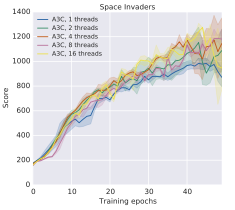

# Overview

The goal is to reproduce results from the original [Asynchronous Advantage Actor-Critic (A3C) Paper](https://arxiv.org/pdf/1602.01783.pdf)

A summary of the paper and high-level implementation plan can be found [here](./Motivation_and_Plan.md).

# Results

## Milestone 1: Use A3C to solve Cart-Pole

Before jumping into the complexity of Atari games and RL with Convolutional Neural Nets, I wanted to verify that my implementation and thread communication were working properly.

Cart-Pole is a fairly straightforward task, which has a [reference implementation in PyTorch](https://github.com/pytorch/examples/blob/main/reinforcement_learning/actor_critic.py) from which I could borrow some architecture and training parameters.

I was able to replicate the reference results, as well as see a speedup with multiple agents. I was then able to utilize agents running on multiple threads to solve CartPole as shown below:

The code which achieves all of these results [were written as unit tests](../../tests/test_a3c.py)

## Milestone 2: Match A3C Tuning Performance on SpaceInvaders

It turns out the M2 processor on my MacBookAir did not have the compute power to replicate the full picture of Figure 2 (each point would take roughly 24 hours to replicate). So I declared victory after matching a score of 800 (the mode of the results) after 50 epochs.

I had to make some modifications relative to the paper to get this to work:

- I used the Adam optimizer
- I implemented a thread lock on the global agent when backpropagating and updating parameters
- I turned the learning rate down to 1e-4 since Adam has a momentum term and momentum was not used in the original paper.
- I did not end episodes on loss of life. This was suggested in follow up work, and I think it simplified my code and made training more stable.
- I did not utilize an annealing learning rate scheduler.
- Gradient norm clipping was set to 50 (as seen in a few open source implementations)
- I used 6 threads instead of 4, 8, of 16 since the M2 has 8 cores and I needed to run other programs.

Here is a GIF of the agent playing the game at epoch 48.

## Milestone 3: Reproduction of Training Curves

### Space Invaders

Curiously, the result in the plot below represents the average of the top three learning rates. Given that there are 3 positive outlier points in the figure above, and my compute limited compute budget, I did not feel compelled to replicate this slightly cherry-picked result.

Below is my training curve over 50 epochs (each epoch is 4M frames, or 1M steps with a frame skip of 4). The data represents a heavily smoothed average score per episode.

Here is a less smoothed version (running average with a decay rate of 0.95, reported every 4 epoisodes).

As can be seen in the GIF above, the game gets significantly more challenging when the score reaches around 600, the last enemies speed up significantly, and the game ends if the fast enemy reaches the bottom. This can be observed in the training curve, where the rate of progress slows down near that point.

### Pong

Below shows the heavily and less smoothed training curves for Pong, which was solved in roughly 2 hours. The hyperparameters were the same as above, except 7 agent threads were used.

These compare favorably with the training curves in the paper:

Upon rendering the game, it was discovered that due to the deterministic nature of the Atari system, the agent was able to setup a serve-shot-score loop against the opponent to run up the score very quickly.

This makes the games quite boring, so I re-introduced the reccommended random action probability of 25% to the environment which 25% of hte time ignores the agent's action in favor of their previous action. This breaks determinism and adds an extra challenge for the agent. The same serve-shot-score loop can be observed a few times, but is quickly broken by the action randomness. One can also observe the agent randomly missing easy volleys, but also scoring in a variety of situations:

### Breakout

Here is a result of training the algorithm on Breakout for 26 epochs, which achieves a score in the mid 400s, matching the hyperparameter tuning performance in the original paper.

The training curve does not exactly match the paper, and it can be seen that the training is unstable:

My hypotheses are that this could be caused by not enough gradient clipping, or the usage of momentum with Adam while the original paper used RMSprop with no momentum.

## Milestone #4: Using an LSTM

### Pong

Below shows the LSTM playing Pong. This agent takes an action on every frame. Like the frame buffer model, it also tends to get stuck in a serve-return-score loop.

Since it is not forced to repeat actions, this agent is a little smoother compared to the frame buffer agent. Here is the training curve. It is a bit slower since it is a larger model and it is making 4 times as many action decisions. It also appears to have maxed out at a score of around 17.

