# Introduction

The mountain car problem piqued my interest when learning about semi-gradient SARSA in [Sutton and Barto Chapter 10.1](http://incompleteideas.net/book/the-book-2nd.html).

I was intrigued by the need for tile-coding, and was curious if a deep neural net could overcome the need for the tile-coding. I also wanted to try out some of the other methods, like Q-learning.

I also wanted to attempt Actor-Critic, a policy gradient method which supposedly has an easier time than action-value estimation methods.


# Methods

As part of a Coursera course, I ended up manually implementing the semi-gradient SARSA algorithm, so I wanted to try using Pytorch for its autograd capabilities.

I decided to try the following algorithms:

1. Q-learning with tile coding
2. Q-learning with a deeper neural net and the raw state values
3. Policy gradient with Actor-Critic

# Results

## Q-learning with Tile coding

The following plot shows the average steps per episode for a tile encoding with 8 tilings of an 8x8 grid (i.e. 512 features). The model was a single layer. The learning rate was 0.0125 over 8 runs of 100 episodes.

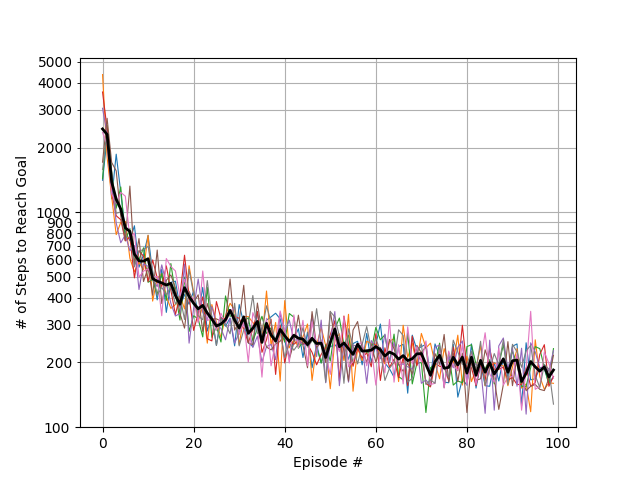

This compares favorably to the learning rate 0.1/8 result from S&B:

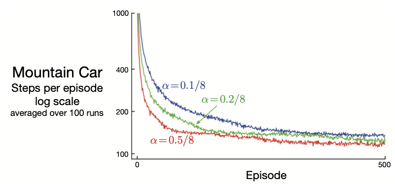


One question which interests me is how an RBF kernel (from my SVM days!) would perform compared to the tile coding (which is unappealing to me for some reason).

## Deep Q Learning

I was curious to try passing the state directly in to the model. I tried a FFW network with 2 intermediate layers of 512 hidden nodes, and ELU activations.

This became fairly tricky, as this particular Q-function is quite complex, and given the infrequent positive feedback of the problem, it was hard to learn the action Q-function with such a setup.

Example $max_a Q(s,a) $ from Sutton & Barto:

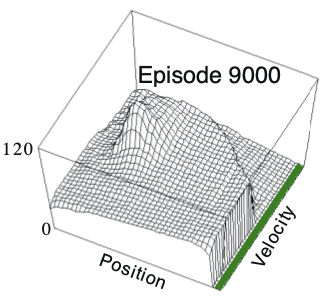


I performed a parameter sweep and was able to find some models that did OK most of the time. This is one of the variable sweeps:

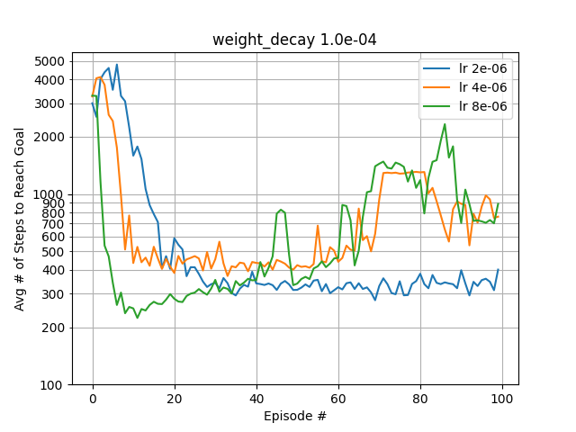


Runs of best performance above:

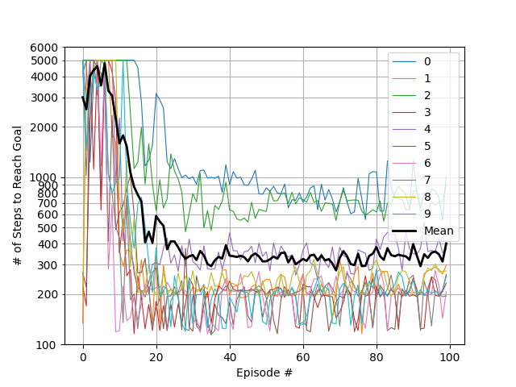

As can be seen, there is a lot of variance in the performance. This was also seen in other attempts to solve the problem this way that I found by Googling. I believe this is due to a number of factors:

1. Doing single step updates to the Q-fuction, which are noisier.
2. Lots of initial time steps where the goal is not reached which can mis-calibrate the Q-function, which is trying to regress the true value.
3. Learning rate might be too high at end.
4. Neural network needing more layers to represent a more complex function, but such complexity being difficult to learn from the environment returns.

We can see the learned $max_a Q(s,a) $ for a model that performed well:

```
ADD THIS
```
And one that did not:

```
ADD THIS
```


I ultimately decided to move on since there were other algorithms to try which are more suited to the problem. If I had to obtain better performance out of this algorithm, I would:

1. Try a learning rate scheduler to reduce learning rate as a function of episodes
2. Add a queue to store a batch of steps to update the Q function with. This would hopefully make the updates more stable.
3. Add a planning queue, which could sample more often from states near the goal once it was found.
4. Investigate other model architectures: deeper, wider, and/or other activation functions.
5. Implement early stopping and/or re-initializing when performance degrades or goal is never reached after X episodes.
6. Tweak the network initialization in order to always start close to zero value.
7. Run a parameter sweep on the exploration parameter (epsilon).

## Actor-Critic

The advantage of actor-critic is that it is a policy gradient algorithm, which is to say, it learns a policy directly. In order to do so with incremental bootstrapped updates, it also needs to learn a state-value function so that it can estimate the value of the next state.

For the Actor-Critic algorithm, I again used semi-gradient single step updates with the raw state as input (rescaled to interval [-1, 1]). But I used separate actor and critic networks with different optimizer settings and architectures:

| Setting            | Actor | Critic |
|----------          | ------| ------ |
| lr                 | 2e-4  | 3e-4   |
| weight decay       | 0     |      0 |
| int. layers        | 2     |      2 |
| nodes per layer    | 48    |    384 |
| activation         | ELU   |    ELU |


The results are much improved and the hyperparameters were easier to obtain:

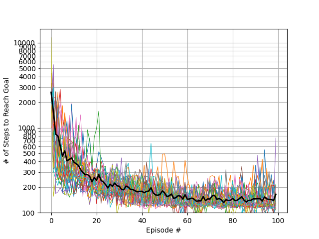

The variance on the models as they are training is a bit concerning. If I were deploying this algorithm, I would investigate other values for learning rate and weight decay and the model architectures to attempt to reduce those spikes.


Here is the learned policy, which makes sense, as it accelerates left when it has negative momentum in order to get up the left ramp to gain potential energy, and then accelerates to the right when it has positive momentum.

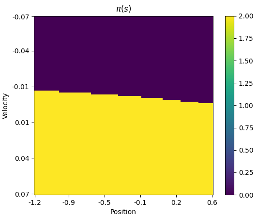

The learned value estimate below may explain some of this issue, as a discount factor $\gamma=0.9$ was used. This leaves a maximum value of $\frac{-1}{1-\gamma} = -10$ as seem in the plot. This may make it hard for the algorithm to bootstrap better actions near the starting point.

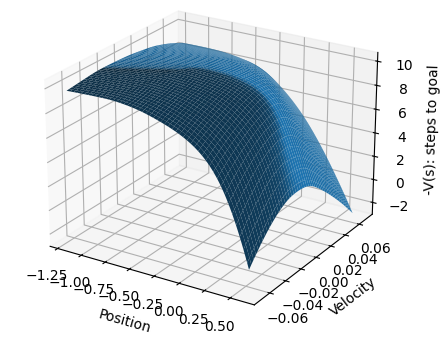

We can in fact observe this behavior comparing the long running episode 60 which struggles early (likely due to action saturating the expected value at -10):

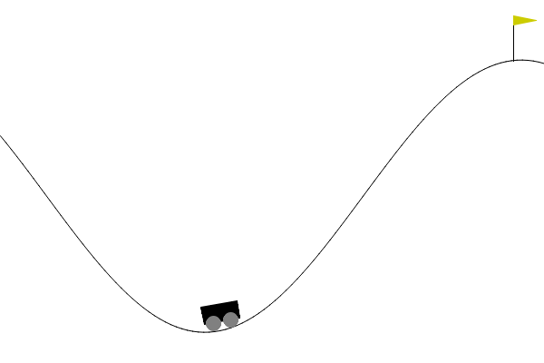

With the much shorter episode 62 which takes advantage of its starting point:

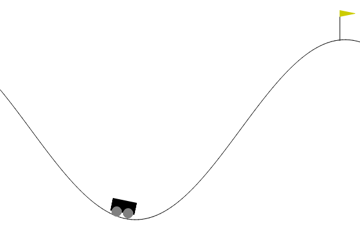

### Updated Discount Factor

Setting $\gamma = 0.99$ to attempt to match the expected value of $V(s)$ led to more variance. $\gamma = 0.999$ was highly divergent.

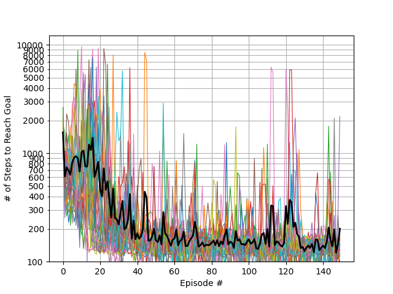

Setting $\gamma = 0.95$ reduced the variance slightly with respect to $\gamma = 0.9$. Tuning $\gamma$ feels unprincipled, and was mentioned in my class as a motivation for using the average return formulation.

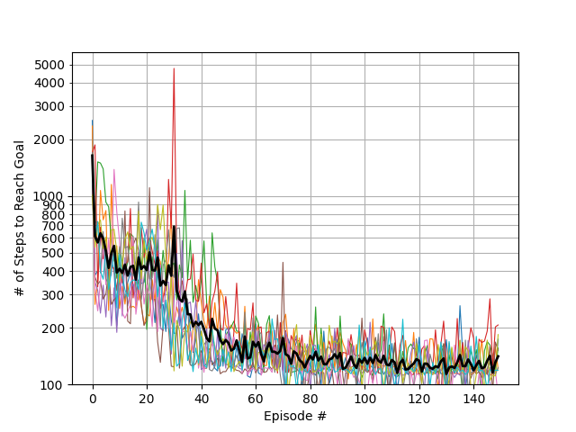

Here are the policy and value functions for a single run at episode 120 which have more structure than $\gamma=0.9$:

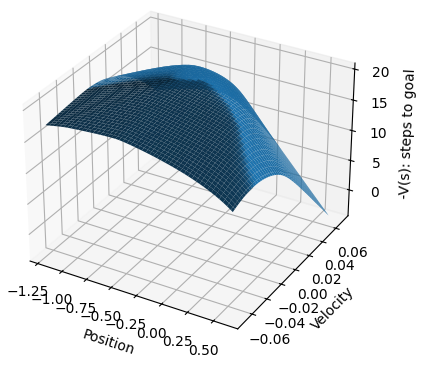

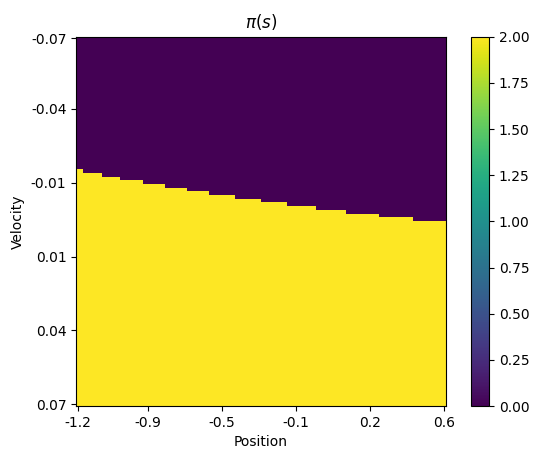


This motivates me to implement Asynchronous Advantage Actor Critic (A2C / A3C)! (Asynchronous multiple agents doing batch updates will also help with learning stability I bet) And preferably on a new problem. I may be legally obligated to change my name to Kate Bush after running up that hill so many times! ;P

